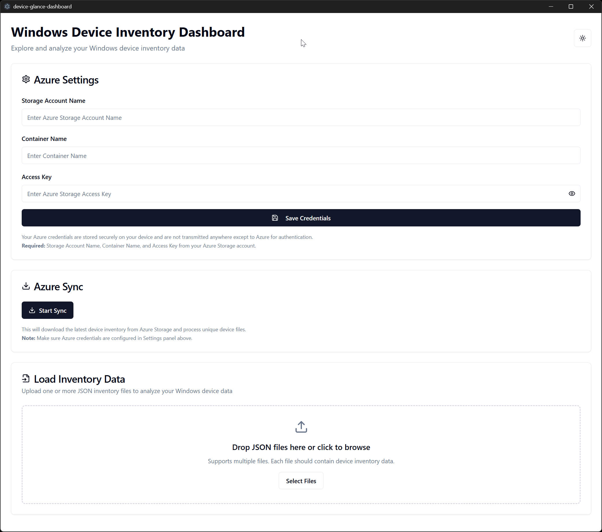
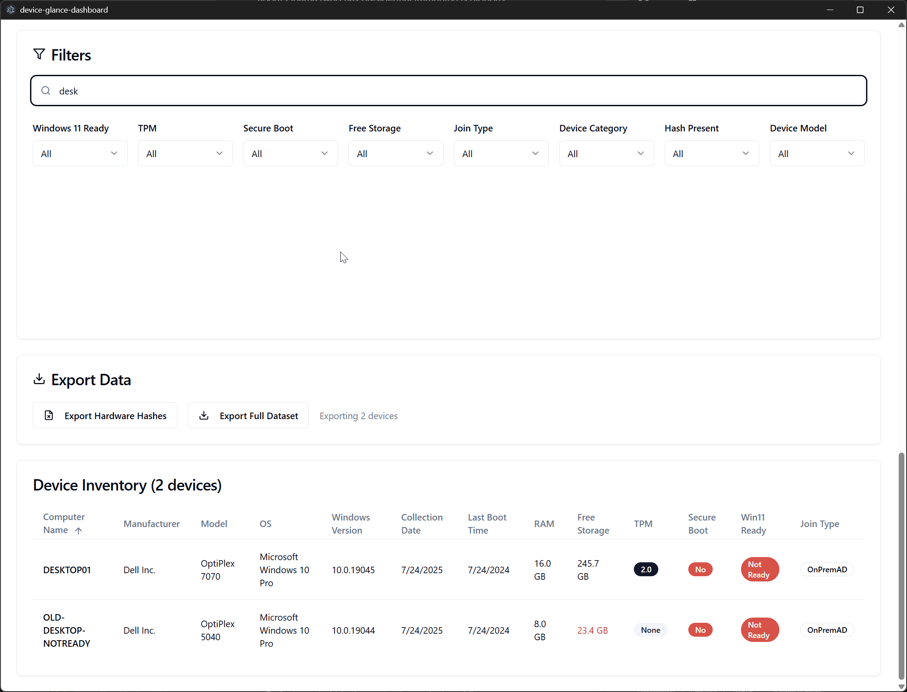
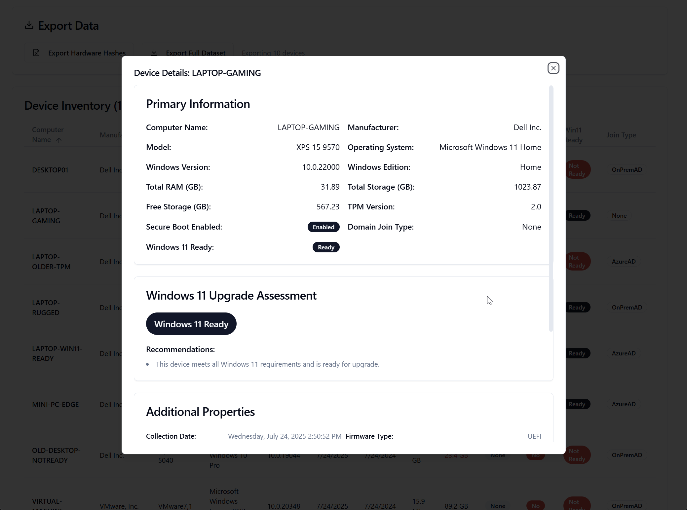
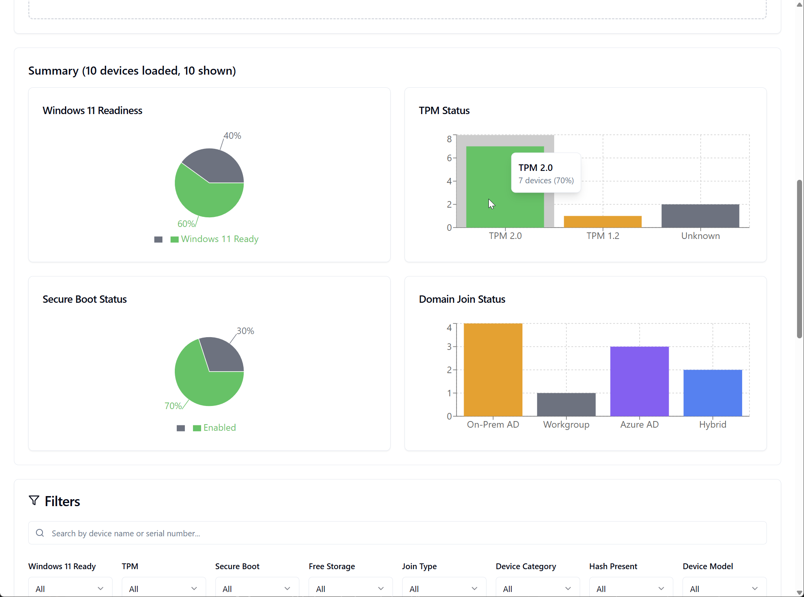
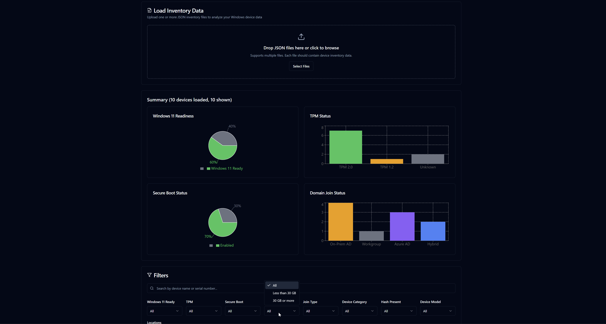

# Device Glance Dashboard

A comprehensive Windows device inventory management system built with React, TypeScript, and Electron. This application provides IT professionals with powerful tools to analyze device compliance, track Windows 11 readiness, and manage device inventories across organizations.

## 🚀 Quick Start

**Option 1: Download Pre-built Installer (Recommended)**
1. Go to the [Releases page](https://github.com/vacuumboots/device-glance-dashboard/releases)
2. Download the latest `Device-Glance-Dashboard-Setup-*.exe` installer
3. Run the installer and launch the application
4. Configure your Azure Storage credentials in the Settings panel
5. Upload device inventory JSON files or sync from Azure Storage

**Option 2: Run from Source**

## How to Run This Project

This project requires Node.js & npm - [install with nvm](https://github.com/nvm-sh/nvm#installing-and-updating)

### Development Setup

```sh
# Step 1: Clone the repository
git clone https://github.com/vacuumboots/device-glance-dashboard.git

# Step 2: Navigate to the project directory
cd device-glance-dashboard

# Step 3: Install dependencies
npm i

# Step 4: Start the development server
npm run dev
```

### Desktop Application

Run the Electron desktop app:

```sh
npm run electron:dev
```

### Development Options

**Local Development**
- Use your preferred IDE to edit files locally
- Run `npm run dev` for web development
- Run `npm run electron:dev` for desktop development

**GitHub Codespaces**
- Click the "Code" button on the repository page
- Select "Codespaces" and create a new codespace
- Edit files directly in the browser-based VS Code environment

## What technologies are used for this project?

This project is built with:

- **Vite** - Fast build tool and development server
- **TypeScript** - Type-safe JavaScript with strict mode
- **React 18** - Modern React with hooks and concurrent features
- **shadcn-ui** - High-quality, accessible UI components
- **Tailwind CSS** - Utility-first CSS framework
- **Electron** - Desktop application framework
- **Vitest** - Fast unit testing framework
- **React Testing Library** - Component testing utilities

## ✨ Key Features

### Data Management
- 📊 **Device Inventory Management** - Upload and analyze Windows device data from PowerShell scripts
- 🔄 **Azure Storage Integration** - Secure sync with Azure Blob Storage containers
- 🔍 **Advanced Search** - Search devices by computer name or serial number
- 📤 **Data Export** - CSV export functionality for filtered datasets

### Analysis & Filtering
- 🔍 **Advanced Filtering** - 9 different filter types including:
  - Windows 11 readiness status
  - TPM presence and version
  - Secure Boot compliance
  - Storage thresholds (low storage alerts)
  - Domain join types (Azure AD, On-Prem AD, Hybrid, Workgroup)
  - Device categories (Desktop, Laptop, Other)
  - Hardware hash presence
  - Device model filtering
  - Location-based filtering with community grouping
- 📈 **Summary Charts** - Visual analytics for device fleet composition and compliance metrics
- 🏢 **Location-Based Analysis** - IP-based location detection with community grouping

### Security & Compliance
- 🔒 **Security Compliance Tracking** - TPM, Secure Boot, and Windows 11 readiness analysis
- 🛡️ **Windows 11 Assessment** - Comprehensive upgrade readiness reporting
- 🔐 **Secure Credential Storage** - AES-256-GCM encryption for Azure credentials

### User Experience
- 🖥️ **Desktop Application** - Native Windows installer with auto-updates
- ⚙️ **Settings Panel** - User-friendly configuration interface
- 🎨 **Dark/Light Theme** - Modern UI with theme switching
- 📱 **Responsive Design** - Works on desktop and web browsers

## 📸 Screenshots

### Main Dashboard

*Device inventory table with filtering, search, and summary charts*

### Device Search

*Search devices by computer name or serial number with real-time filtering*

### Device Details Modal

*Comprehensive device information with Windows 11 upgrade assessment*

### Summary Charts

*Visual analytics for device fleet composition and compliance metrics*

### Dark Mode Theme

*Modern dark theme with full feature compatibility*

<!-- Alternative: Host screenshots on GitHub Issues
You can also upload images to a GitHub issue and use those URLs:

-->

## Testing

Comprehensive testing framework with 81 tests covering:

```bash
npm test              # Watch mode development
npm run test:run      # Single run for CI/CD
npm run test:ui       # Visual test interface
npm run test:coverage # Coverage reporting
```

- **Unit Tests** (29) - Utility functions and business logic
- **Component Tests** (38) - UI components and interactions
- **Integration Tests** (8) - Data flow and filtering workflows
- **End-to-End Tests** (5) - Complete user scenarios

## 🚀 Deployment & Distribution

### Automated Releases
The project uses GitHub Actions for automated builds and releases:

- **Automatic Builds** - Every push to main triggers a Windows build
- **Release Creation** - Tagged releases automatically generate installer executables
- **Artifact Upload** - Built installers are automatically uploaded to GitHub Releases

### Manual Deployment

#### Desktop Application (Recommended)
```sh
# Build the desktop application
npm run build-electron

# Or create distributable installer
npm run dist
```

#### Web Application
```sh
# Build web version for static hosting
npm run build
```

The built files will be in the `dist` directory and can be deployed to any static hosting service.

### Release Process

#### Automated Installer Creation
To create a new release with installer:

1. **Update Version Numbers**
   ```bash
   # Update version in package.json (both main version and extraMetadata)
   npm version patch  # or minor/major
   ```

2. **Commit Version Changes**
   ```bash
   git add package.json
   git commit -m "Bump version to v1.x.x for release"
   ```

3. **Create and Push Release Tag**
   ```bash
   git tag v1.x.x
   git push origin main
   git push origin v1.x.x
   ```

4. **Monitor GitHub Actions**
   - Check [Actions tab](https://github.com/vacuumboots/device-glance-dashboard/actions) for build progress
   - Build creates Windows installer (.exe) automatically
   - Installer uploaded to [Releases page](https://github.com/vacuumboots/device-glance-dashboard/releases)

#### GitHub Actions Workflow
The `.github/workflows/release.yml` workflow:
- **Triggers**: Push to main branch, version tags (v*), or manual dispatch
- **Builds**: Windows executable with electron-builder
- **Uploads**: Installer files to GitHub Releases for version tags
- **Duration**: ~5-10 minutes for complete build and upload

## 📋 Recent Changes

### July 24, 2025 - Device Search & UI Improvements (v1.1.5)

- **🔍 Device Search Functionality** - Added search capability for device table
  - Search by computer name or serial number
  - Case-insensitive search with real-time filtering
  - Integrated search input with existing filter system
- **🖥️ Enhanced Device Details Modal** - Fixed display formatting issues  
  - Proper handling of complex objects (TPMInfo, SecureBootStatus, HardwareHash)
  - Improved .NET Date format parsing for timestamps
  - Better formatting for CollectionDate and other object fields
  - Resolved `[object Object]` display issues
- **📚 Comprehensive Documentation** - Added CLAUDE.md for development guidance
  - Complete architecture overview and development patterns
  - Essential commands for build, test, and lint operations
  - Key component structure and data flow documentation

### July 14, 2025 - Fix PowerShell Script Path Resolution (v1.1.4)

- **🔧 Enhanced Path Resolution** - Fixed PowerShell script path detection in packaged apps
  - Added `extraResources` configuration to ensure script is accessible
  - Enhanced path resolution with proper Electron app paths
  - Added comprehensive path checking for both development and production
  - Improved error messages showing all checked paths for troubleshooting

### July 14, 2025 - Fix PowerShell Script Packaging (v1.1.3)

- **🔧 Fixed Script Packaging** - PowerShell script now included in installer build
  - Added `sync_inventory.ps1` to electron-builder files configuration
  - Enhanced script path resolution with multiple fallback locations
  - Added better error messages for script not found scenarios
  - Improved robustness for packaged application deployment

### July 14, 2025 - User-Friendly Configuration Interface (v1.1.2)

- **🔧 Settings Panel** - Added intuitive settings interface for Azure credentials
  - Storage Account Name, Container Name, and Access Key input fields
  - Show/hide toggle for sensitive access key
  - Real-time validation and user feedback
  - Clear error messages and success notifications
- **🔒 Secure Credential Storage** - Implemented AES-256-GCM encryption for local credential storage
  - Credentials encrypted and stored in user's data directory
  - Automatic key generation and management per installation
  - No credentials transmitted except to Azure for authentication
- **📱 Enhanced User Experience** - Eliminated need for .env files and environment variables
  - Users can now download executable installer and configure directly in-app
  - Settings panel prominently placed above sync functionality
  - Graceful fallbacks and clear guidance when credentials are missing
- **🔄 Updated Sync Service** - Modified to use stored credentials instead of environment variables
  - Reads encrypted credentials from secure storage
  - Provides clear error messages if credentials not configured
  - Maintains backward compatibility with existing PowerShell scripts
- **🛡️ Security & Code Quality** - All linting issues resolved with proper TypeScript types
  - Enhanced IPC handlers for credential management
  - Proper error handling and user feedback
  - Secure encryption implementation following best practices

### July 14, 2025 - System Verification & Environment Setup

- **✅ Comprehensive System Verification** - Verified all project components work correctly
  - Fixed React Router test context issues for proper test execution
  - Confirmed Electron production build loads UI correctly
  - Verified Electron development environment loads properly
  - Confirmed web preview serves the application correctly
  - Added dotenv support for environment variable loading
- **🔧 Environment Configuration** - Enhanced environment variable handling
  - Added dotenv dependency and configuration to Electron main process
  - Created .env file support for Azure Storage configuration
  - Verified sync script can access environment variables properly
  - Ensured PowerShell sync script integration works correctly
- **🧪 Test Framework Improvements** - Enhanced test reliability and coverage
  - Fixed router context mocking in test setup
  - Updated test utilities to handle React Router properly
  - Verified test suite passes with improved stability
- **📦 Version Update** - Updated to version 1.1.1 for deployment testing

### July 10, 2025 - Major Testing & Quality Implementation

- **🧪 Comprehensive Testing Framework** - Implemented complete testing suite with 81 tests
  - Unit tests for all utility functions (device parsing, filtering, export, charts)
  - Component tests for UI interactions and accessibility
  - Integration tests for filtering workflows and data flow
  - End-to-end tests for complete user scenarios (IT audits, security compliance)
- **⚙️ Test Configuration** - Added Vitest + React Testing Library + JSDOM setup
- **🛡️ Enhanced Error Handling** - Comprehensive error handling for file uploads, data parsing, and UI interactions
- **📋 Device Model Filter** - Added dynamic device model filtering with alphabetical sorting
- **🔧 Code Quality** - ESLint compliance, Prettier formatting, TypeScript strict mode
- **📚 Documentation** - Added comprehensive testing documentation and configuration summaries
- **🚀 CI/CD Ready** - Test scripts and coverage reporting for automated workflows

### July 9, 2025

- **Added Last Boot Time column** to the device inventory table with proper .NET Date format parsing
- **Fixed Collection Date parsing** to handle complex object structure with nested date properties
- **Added Hash Present filter** to filter devices based on whether they have a hardware hash in their records
- Improved date formatting functions to handle various date formats from device exports

## Documentation

- 📋 **[Configuration Summary](./CONFIGURATION_SUMMARY.md)** - Detailed overview of all configuration files and testing setup
- 🛡️ **[Error Handling Guide](./ERROR_HANDLING.md)** - Comprehensive error handling documentation
- 🧪 **[Testing Guide](./src/__tests__/README.md)** - Complete testing framework documentation
